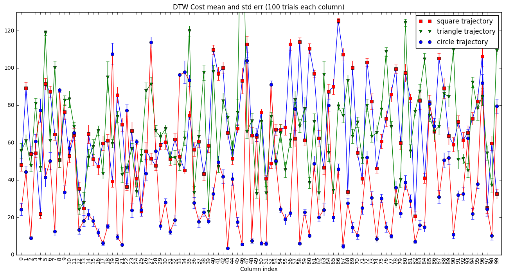
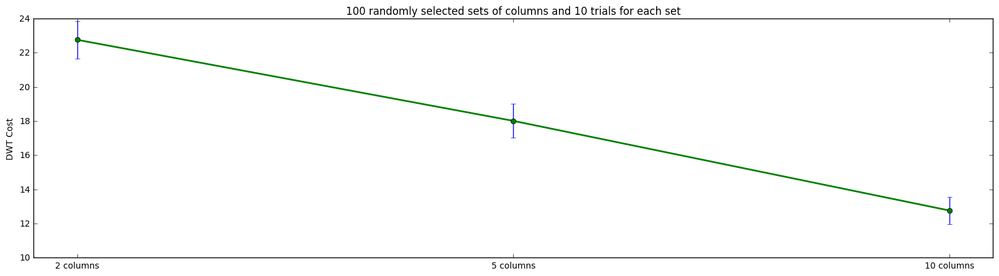
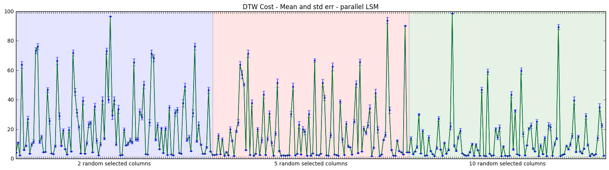
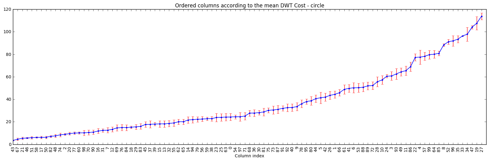

# SNN-Experiments
Here I'm sharing some of the **initial and/or unpublished** experiments I did with spiking neural networks (SNN). As I don't have time to expand them I hope they are going to be useful to someone else. Probably there are some (or lots of?) bugs, so feel free to correct them :)   

Biased Unsupervised Learning Method: a novel(???) way to use STDP  
https://github.com/ricardodeazambuja/SNN-Experiments/blob/master/Biased%20Unsupervised%20Learning%20Method/Biased%20Unsupervised%20Learning%20Method.ipynb  

Feedback in complex spiking neural networks   
https://github.com/ricardodeazambuja/SNN-Experiments/blob/master/Feedback%20in%20complex%20neural%20system/Feedback_Experiment_1.2_V_and_I_WITHOUT_saturation.ipynb   

Implementing a Liquid State Machine using Brian Simulator   
https://github.com/ricardodeazambuja/SNN-Experiments/blob/master/Implementing%20a%20Liquid%20State%20Machine%20using%20Brian%20Simulator/Implementing%20a%20Liquid%20State%20Machine%20using%20Brian%20Simulator.ipynb  

Improving the resolution of population coding by the use of multiple layers  
https://github.com/ricardodeazambuja/SNN-Experiments/blob/master/Multilayer%20population%20code/Improving%20the%20resolution%20of%20population%20coding%20by%20the%20use%20of%20multiple%20layers.ipynb

## Crazy ideas
### 1. Stochastic Resonance
The idea is to study better the effects of noise.

"In order to exhibit stochastic resonance (SR), a system should possess three basic properties: a non-linearity in terms of threshold, sub-threshold signals like signals with small amplitude and a source of additive noise. This phenomenon occurs frequently in bistable systems or in systems with threshold-like behavior [18]. The general behavior of SR mechanism shows that at lower noise intensities the weak signal is unable to cross the threshold, thus giving a very low SNR. For large noise intensities the output is dominated by the noise, also leading to a low SNR. But, for moderate noise intensities, the noise allows the signal to cross the threshold giving maximum SNR at some optimum additive noise level"

From:
Chouhan, Rajlaxmi, C. Pradeep Kumar, Rawnak Kumar, and Rajib Kumar Jha. “Contrast Enhancement of Dark Images Using Stochastic Resonance in Wavelet Domain.” International Journal of Machine Learning and Computing, 2012, 711–15. doi:10.7763/IJMLC.2012.V2.220.

### 2. Importance of input code
The idea here is to do the same experiments testing how good random liquids are when doing the drawing task, but in this case I would like to test what happens when the input code changes.

Here they say a body needs to change in order to do a different morphological computation:
https://www.researchgate.net/publication/308500845_Morphosis_Taking_Morphological_Computation_to_the_Next_Level

But my guess is that changing only the input code is going to make a huge difference already because I had problems with my old input codes.

### 3. Ensembles and Evolutionary Algorithms
For [my IJCNN2016 paper](https://github.com/ricardodeazambuja/IJCNN2016), I had multiple 'liquids' working in parallel generating better results than individuals ones. Below it's a figure (unpublished results) that shows random generated liquids are hardly good (or bad!) in all tasks:  
  
However, when you test them for only one task, even randomly mixing them generates a better result:  
  
  
Another interesting (quite obvious) fact is that random generated liquids are... not great in general, but some generate much better results than others:
  
Maybe, it's not possible to have 'one neural circuit to rule them all'. Also, evolutionary algorithms could be useful to iterate based on the best random generated ones creating better invidual liquids. That's it, food for thought!

## If you liked the stuff above, you may want to check [BEE - The Spiking Reservoir (LSM) Simulator](https://github.com/ricardodeazambuja/Bee)

https://ricardodeazambuja.com/
